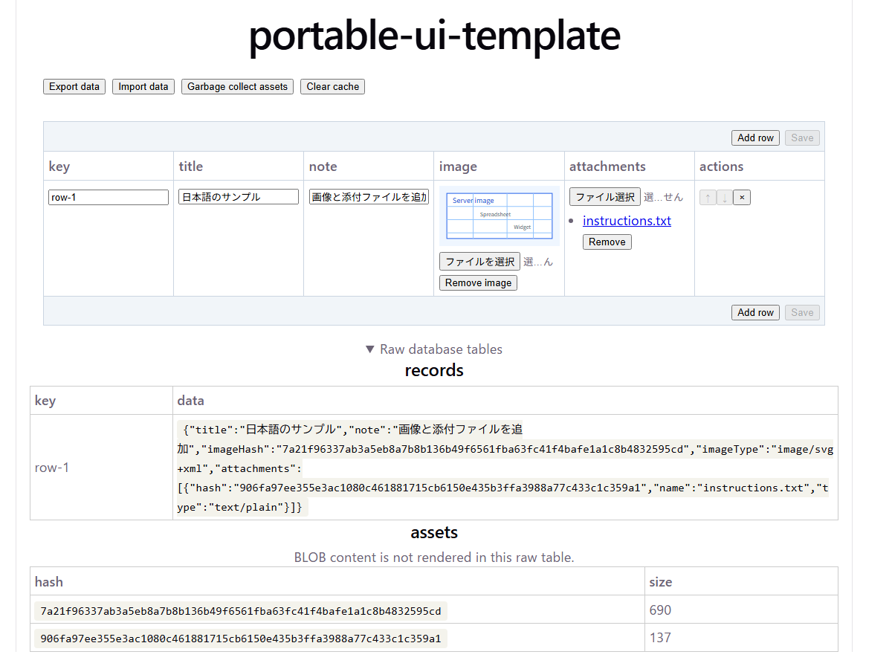

# portable-ui-template

[English README](README.md)

共有編集グリッド、Browser DuckDB-WASM/OPFS永続化、Streamlit adapter、境界ごとの
設計ルールを備えた、React + Vite向けのportable UI templateです。

**GitHub Pages:** <https://kyusque.github.io/portable-ui-template/>



## 前提条件

- `packageManager`で固定されたpnpm 11.22.0
- Python依存関係管理用の[uv](https://docs.astral.sh/uv/getting-started/installation/)

Windowsではwingetで両方を導入できます。

```bash
winget install pnpm.pnpm
winget install astral-sh.uv
```

Windows版pnpm packageはViteが使うNode.js runtimeを同梱するため、別途Node.jsを導入する
必要はありません。他platformではpnpmとuvの公式インストール手順を使ってください。
互換するPythonが未導入なら、`uv sync`と`uv run`が必要なPython releaseを取得します。

## セットアップ

```bash
pnpm install
uv sync
```

Browser開発サーバー:

```bash
pnpm dev
```

Streamlit widgetをbuildし、開発demoを起動:

```bash
pnpm build:streamlit
uv run streamlit run streamlit_sample/app.py
```

## build target

| コマンド | 出力先 | 用途 |
| --- | --- | --- |
| `pnpm build` | `dist/portable-ui-template/` | 標準Browser package |
| `pnpm build:pages` | `docs/index.html` + `docs/duckdb-wasm/` | GitHub Pages |
| `pnpm build:static` | `static-site/index.html` | CDN参照のstandalone handoff |
| `pnpm build:streamlit` | `streamlit_portable_ui_sample/frontend/` | Streamlit custom component |

Pages entryはapplication JavaScript/CSSをinline化し、DuckDB
Worker/WASM runtimeを`docs/duckdb-wasm/`へ置きます。standalone artifactは、
固定したDuckDB runtimeをCDNから読む単一HTMLです。各Streamlit widgetもJavaScript/CSSを
inline化した単一HTMLです。

## ディレクトリ構成

```text
.github/skills/                  # 設計ルールと検証基準
docs/index.html                  # GitHub Pages entry
docs/duckdb-wasm/                # GitHub PagesのDuckDB runtime
static-site/index.html           # CDN参照のstandalone artifact
dist/portable-ui-template/       # 標準Browser package
streamlit_portable_ui_sample/    # package化されたStreamlit component
streamlit_sample/app.py          # Streamlit統合とDuckDBの例
src/
  components/                    # 共有React presentation component
  App.tsx                        # 標準Browser integrationの例
  hooks/                         # 標準Browser React hook
  storage/                       # Browser永続化の実装
  adapters/                      # 非標準host adapter
  entries/                       # host別の薄いmount
```

## データ契約

BrowserとPythonのexportは、同じDuckDB schemaを使います。

```sql
CREATE TABLE records (
  key TEXT NOT NULL PRIMARY KEY,
  data JSON
);

CREATE TABLE assets (
  hash TEXT NOT NULL PRIMARY KEY,
  content BLOB NOT NULL,
  size INTEGER NOT NULL
);
```

record JSONにはasset参照とmetadataだけを置き、binary dataは`assets`だけに置きます。
Browser appはdatabaseをOPFSへ保存し、`.duckdb`のexport/importを提供します。

## Skills

| Skill | 適用する変更 |
| --- | --- |
| `portable-ui-architecture.md` | source境界・project構造 |
| `portable-ui-component-design.md` | shared UI・component contract・編集state・adapter |
| `portable-ui-storage.md` | 永続化・DuckDB・CAS・cache・import/export |
| `portable-ui-delivery.md` | build target・配布artifact |
